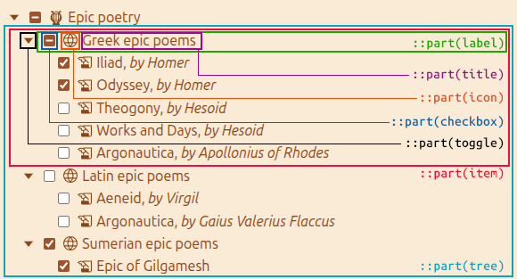

# `<cbx-tree>`: The Checkbox Tree element

The `<cbx-tree>` element is a web component for building tree-like hierarchic lists with checkable items. Tree items in the `<cbx-tree>` element are collapsible if they have nested subtrees. Every item is equipped with a checkbox which can be in one of the following states:

* *checked*: the item and all its children are checked,
* *unchecked*: the item and all its children are unchecked,
* *indeterminate*: the item is technically unchecked but some its children are checked.


## Installation and import

If you use a bundler in your project, install cbx-tree as a dependency:

```shell
npm install cbx-tree
```

Now you may import it wherever it’s needed:

```javascript
import 'cbx-tree';
```

If you don’t use bundlers, just import the component as a module in your HTML files:

```html
<script type="module" src="https://esm.run/cbx-tree"></script>
```

or in ES modules:

```javascript
import "https://esm.run/cbx-tree";
```

## Usage notes

There are two ways to feed initial tree data to the `<cbx-tree>` component.

The first way is to provide tree data directly in HTML by adding JSON content as follows:

```html
<cbx-tree name="reading-list[]">
  <script type="application/json">
    [
      {
        "title": "Epic poetry",
        "value": "category-123",
        "icon": "/icons/epic-icon.svg",
        "children": [
          {
            "title": "Ancient Greek poems",
            "value": "category-179",
            "icon": "/icons/greek-icon.svg",
            "children": [
              {
                "title": "Iliad",
                "value": "book-10",
                "icon": "/icons/manuscript-icon.svg",
                "checked": true
              },
              {
                "title": "Odyssey",
                "value": "book-11",
                "icon": "/icons/manuscript-icon.svg",
                "checked": true
              }
            ]
          },
          {
            "title": "Ancient Mesopotamian poems",
            "value": "category-151",
            "icon": "/icons/mesopotamian-icon.svg",
            "collapsed": true,
            "children": [
              {
                "title": "Epic of Gilgamesh",
                "value": "book-8",
                "icon": "/icons/clay-tablet-icon.svg"
              }
            ]
          }
        ]
      }
    ]
  </script>
</cbx-tree>
```

> [!NOTE]
> Similarly to the `<textarea>` content, the data you provide in HTML is only used as a *default value*. In other words, dynamic updates of the HTML content don’t affect the current tree. To update the tree dynamically, one should use the [JavaScript API](#cbxtreesetdata) provided by the component.

The second option is to fill the initial tree programmatically using the [`setData()`](#cbxtreesetdata) method.

**HTML:**

```html
<cbx-tree name="reading-list[]"></cbx-tree>
```

**JavaScript:**

```javascript
customElements.whenDefined('cbx-tree').then(() => {
  const readingList = document.querySelector('[name="reading-list[]"]');
  readingList.setData([
    {
      title: 'Epic poetry',
      value: 'category-123',
      icon: '/icons/epic-icon.svg',
      children: [
        {
          title: 'Ancient Greek poems',
          value: 'category-179',
          icon: '/icons/greek-icon.svg',
          children: [
            {
              title: 'Iliad',
              value: 'book-10',
              icon: '/icons/manuscript-icon.svg',
              checked: true,
            },
            {
              title: 'Odyssey',
              value: 'book-11',
              icon: '/icons/manuscript-icon.svg',
              checked: true,
            },
          ],
        },
        {
          title: 'Ancient Mesopotamian poems',
          value: 'category-151',
          icon: '/icons/mesopotamian-icon.svg',
          collapsed: true,
          children: [
            {
              title: 'Epic of Gilgamesh',
              value: 'book-8',
              icon: '/icons/clay-tablet-icon.svg',
            },
          ],
        },
      ],
    },
  ]);
});
```

> [!NOTE]
> JavaScript API of the `<cbx-tree>` component becomes fully functional as soon as the element is registered and defined. To stay on the safe side, it’s worth using the [`whenDefined()`](https://developer.mozilla.org/en-US/docs/Web/API/CustomElementRegistry/whenDefined) guard as shown in the example above.

## Tree data structure

As shown in the examples above, the tree is initialised with an array of objects representing the tree’s root items. Each item can have children forming a nested subtree. The table below provides information about the properties that can be specified for tree items at any nesting level.

| Property    | Type             | Required | Description                                                       |
| ----------- | ---------------- | -------- | ----------------------------------------------------------------- |
| `title`     | string           | yes      | Text label of the tree item                                       |
| `value`     | string¹          | yes      | Internal value identifying the checked item in the submitted data |
| `icon`      | string           | no       | Item icons’s URL                                                  |
| `checked`   | boolean          | no       | Initial state of the item selection                               |
| `collapsed` | boolean          | no       | Whether a nested subtree is collapsed initially                   |
| `children`  | array or `null`² | no       | Nested subtree items                                              |

¹ Must be unique within the entire tree.\
² The value `null` of the `children` property is used for [on-demand loading of the subtree](#cbxtreesubtreeprovider).

## Attributes

This element includes the [global attributes](https://developer.mozilla.org/en-US/docs/Web/HTML/Reference/Global_attributes).

### `disabled`

Applying this Boolean attribute turns all interactive controls within the tree into the disabled state. Items in the disabled tree cannot be collapsed or expanded by the user, and states of the checkboxes cannot be changed via the GUI.

### `name`

A mandatory attribute `name` is used by the `<cbx-tree>` component to construct data to be submitted with the form. Since the widget contains multiple checkable items, it may be a good idea to use a name with square brackets appended. This notation allows some server-side frameworks treat submitted data as an array.

```html
<cbx-tree name="reading-list[]"></cbx-tree>
```

## Instance properties

The `CbxTree` interface also inherits properties from its parent, [HTMLElement](https://developer.mozilla.org/en-US/docs/Web/API/HTMLElement).

Validation-related properties [`validity`](https://developer.mozilla.org/en-US/docs/Web/API/ElementInternals/validity), [`validationMessage`](https://developer.mozilla.org/en-US/docs/Web/API/ElementInternals/validationMessage), and [`willValidate`](https://developer.mozilla.org/en-US/docs/Web/API/ElementInternals/willValidate) are transparently exposed from the underlying `ElementInternals` object which allows the `<cbx-tree>` element participate in form validation.

### `CbxTree.disabled`

Reflects the value of the element’s [`disabled` attribute](#disabled).

### `CbxTree.form`

The read-only property that references the `HTMLFormElement` associated with this element.

### `CbxTree.formData`

A [`FormData`](https://developer.mozilla.org/en-US/docs/Web/API/FormData) object which contains key-value pairs of the currently checked items in the tree. Note that the element’s [`name` attribute](#name) is used for all keys, so the `FormData` object represents an array of checked values. The property is read-only.

```javascript
const readingList = document.querySelector('[name="reading-list[]"]');
console.log('Checked values:', readingList.formData.getAll('reading-list[]'));
```

### `CbxTree.name`

Reflects the value of the element’s [`name` attribute](#name).

### `CbxTree.subtreeProvider`

The `subtreeProvider` property is used in cases where on-demand subtree loading is required. If your initial tree doesn’t contain data for some nested subtrees, you may define your custom function for subtree generation/fetching which will be called when the user expands the target item for the first time.

> [!IMPORTANT]
> The items that allow on-demand loading, should have their `children` property set to `null` initially.

The custom subtree provider is a function that accepts the value of the target item as its argument and returns a promise that resolves with an array representing a [subtree data](#tree-data-structure) for this specific item.

```javascript
customElements.whenDefined('cbx-tree').then(() => {
  const readingList = document.querySelector('[name="reading-list[]"]');
  readingList.subtreeProvider = async (itemValue) => {
    const response = await fetch(`/reading-list/items/${itemValue}`);
    return (await response.json()).children;
  };
});
```

### `CbxTree.type`

A read-only property provided for consistency with browser-provided form controls. The same as [`Element.localName`](https://developer.mozilla.org/en-US/docs/Web/API/Element/localName).

## Instance methods

The `CbxTree` interface also inherits methods from its parent, [HTMLElement](https://developer.mozilla.org/en-US/docs/Web/API/HTMLElement).

Validation-related methods [`checkValidity()`](https://developer.mozilla.org/en-US/docs/Web/API/ElementInternals/checkValidity), [`reportValidity()`](https://developer.mozilla.org/en-US/docs/Web/API/ElementInternals/reportValidity), and [`setValidity()`](https://developer.mozilla.org/en-US/docs/Web/API/ElementInternals/setValidity) are transparently exposed from the underlying `ElementInternals` object which allows the `<cbx-tree>` element participate in form validation.

### `CbxTree.setData()`

The `setData()` method is used for complete overwriting and rerendering the entire tree. It accepts a single argument, a new [tree data](#tree-data-structure). All existing changes will be lost and replaced by the newly provided data after calling this method. See an example in the [Usage notes](#usage-notes) section.

### `CbxTree.toggle()`

Use this method for dynamic expansion or collapsing of all items in the tree. The method accepts an optional boolean argument, `isExpanding`, which controls whether items should be expanded (`true`) or collapsed (`false`).

```javascript
const readingList = document.querySelector('[name="reading-list[]"]');
readingList.toggle(false); // collapse all
```

Note that this method doesn’t expand items that have [on-demand loading](#cbxtreesubtreeprovider) behavior. Also, programmatic toggling doesn’t trigger the [`cbxtreetoggle` event](#cbxtreetoggle-1).

### `CbxTree.toJSON()`

Returns the current state of the tree in the same format as the array used for tree initialisation. This method allows for JSON serialisation of the control state. 

```javascript
const readingList = document.querySelector('[name="reading-list[]"]');
console.log('Tree data:', JSON.stringify(readingList, null, 2));
```

## Events

### `cbxtreechange`

The `cbxtreechange` custom event is fired when the user changes the state of a checkbox in the tree. A complete information on the tree selection state is available as a [`FormData`](https://developer.mozilla.org/en-US/docs/Web/API/FormData) object through the [`detail`](https://developer.mozilla.org/en-US/docs/Web/API/CustomEvent/detail) property of the event instance.

```javascript
const readingList = document.querySelector('[name="reading-list[]"]');
readingList.addEventListener('cbxtreechange', (e) => {
  const selectionData = e.detail; // FormData instance
  console.log('Selected books & categories:', ...selectionData.values());
});
```

### `cbxtreetoggle`

The `cbxtreetoggle` custom event is fired when the user clicks a toggle button to expand or collapse a subtree under one of the tree items. The `detail` property of the event instance provides additional information about the target item:

| Property   | Description                                                     |
| ---------- | --------------------------------------------------------------- |
| `title`    | Title of the target item                                        |
| `value`    | Value of the target item                                        |
| `newState` | New state of the target item (either `expanded` or `collapsed`) |

```javascript
const readingList = document.querySelector('[name="reading-list[]"]');
readingList.addEventListener('cbxtreetoggle', (e) => {
  const {title, value, newState} = e.detail;
  console.log(`Item “${title}” (${value}) is now ${newState}`);
});
```

## Styling with CSS

The `<cbx-tree>` element provides a few CSS custom properties (variables) that you can override for your needs.

| Variable                         | Data type  | Description                                             |
| -------------------------------- | ---------- | ------------------------------------------------------- |
| `--cbx-tree-toggle-closed-mask`  | `<url>`¹   | Mask image for the toggle button in the collapsed state |
| `--cbx-tree-toggle-open-mask`    | `<url>`    | Mask image for the toggle button in the expanded state  |
| `--cbx-tree-toggle-pending-mask` | `<url>`    | Mask image for the toggle button in the pending state   |
| `--cbx-tree-label-hover-bg`      | `<color>`² | Background color for the highlighted item’s label       |
| `--cbx-tree-label-hover-fg`      | `<color>`  | Text color for the highlighted item’s label             |

¹ https://developer.mozilla.org/en-US/docs/Web/CSS/url_value \
² https://developer.mozilla.org/en-US/docs/Web/CSS/color_value

In the following example, item toggle button’s mask is changed from the default arrow to “+/&minus;” icons:

```css
cbx-tree {
  --cbx-tree-toggle-closed-mask: url('data:image/svg+xml,<svg xmlns="http://www.w3.org/2000/svg" viewBox="0 0 14 14" width="14" height="14"><path d="M3 7L11 7M7 3L7 11" stroke="black"/></svg>');
  --cbx-tree-toggle-open-mask: url('data:image/svg+xml,<svg xmlns="http://www.w3.org/2000/svg" viewBox="0 0 14 14" width="14" height="14"><path d="M3 7L11 7" stroke="black"/></svg>');
}
```

Additionally, parts of the `<cbx-tree>` element can be directly styled through the [`::part()` pseudo-element](https://developer.mozilla.org/en-US/docs/Web/CSS/::part).

> [!CAUTION]
> Directly styling the inner parts of the tree is (to some extent) an advanced technique that comes with the risk of breaking the tree’s UI. Use it as a last resort if the desired result cannot be achieved with regular CSS inheritance.

The available `::part()` pseudo-elements are listed in the following table and are shown in the picture below.

| Pseudo-element     | Matched parts                                        |
| ------------------ | ---------------------------------------------------- |
| `::part(tree)`     | The root tree and any nested subtree                 |
| `::part(item)`     | Any individual item of a tree/subtree                |
| `::part(toggle)`   | Item toggle buttons                                  |
| `::part(label)`    | Wrappers around any item’s checkbox, icon, and title |
| `::part(checkbox)` | Any item’s checkbox                                  |
| `::part(icon)`     | Any item’s icon                                      |
| `::part(title)`    | Any item’s title                                     |


